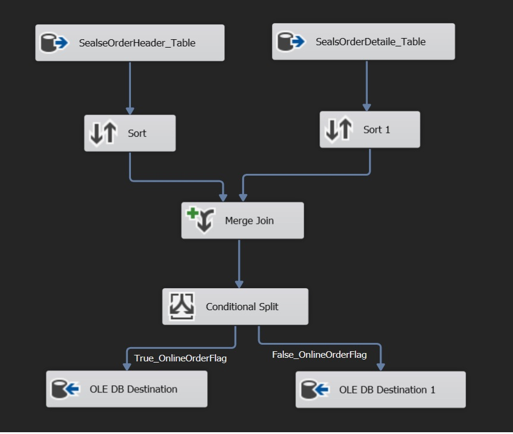

تمرین SSIS – استفاده از Conditional Split
Scenario | سناریو
English

In this exercise, data from the AdventureWorks database is extracted and transformed using SSIS.

Two tables are used:

Sales.SalesOrderHeader
Sales.SalesOrderDetail
These tables are joined using SalesOrderID.

After joining the tables, the data is split based on the value of OnlineOrderFlag.

فارسی

در این تمرین داده‌ها از دیتابیس AdventureWorks با استفاده از SSIS استخراج و پردازش می‌شوند.

دو جدول استفاده شده‌اند:

Sales.SalesOrderHeader
Sales.SalesOrderDetail
این دو جدول با استفاده از ستون SalesOrderID با هم Join می‌شوند.

پس از انجام Join، داده‌ها بر اساس مقدار ستون OnlineOrderFlag دسته‌بندی می‌شوند.

Logic | منطق پردازش
English

If OnlineOrderFlag = TRUE → data is inserted into FactInternetSales
Otherwise → data is inserted into another table
This is implemented using Conditional Split in the Data Flow Task.

فارسی

اگر مقدار OnlineOrderFlag = TRUE باشد → داده در جدول FactInternetSales ذخیره می‌شود
در غیر این صورت → داده در جدول دیگری ذخیره می‌شود
این منطق با استفاده از Conditional Split در بخش Data Flow Task پیاده‌سازی شده است.

Tools | ابزارها
SQL Server
SSIS (Visual Studio 2019)
AdventureWorks Database

## Data Flow

